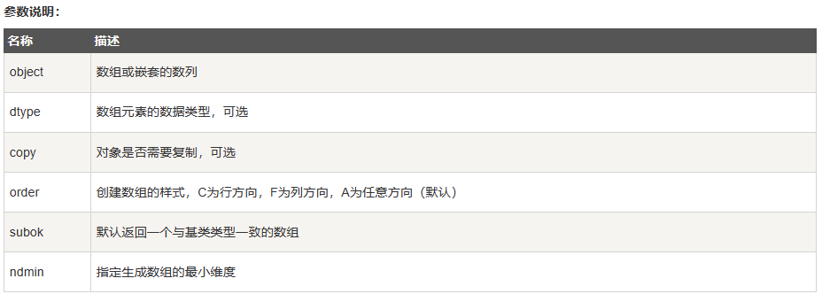
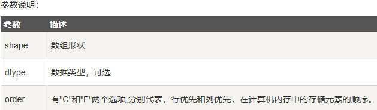
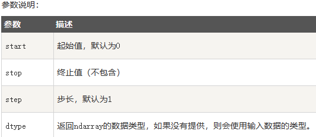
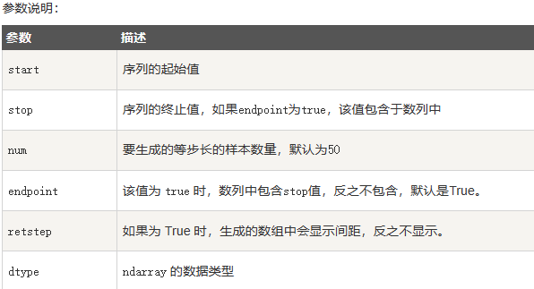
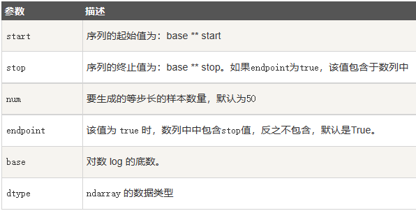
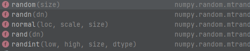
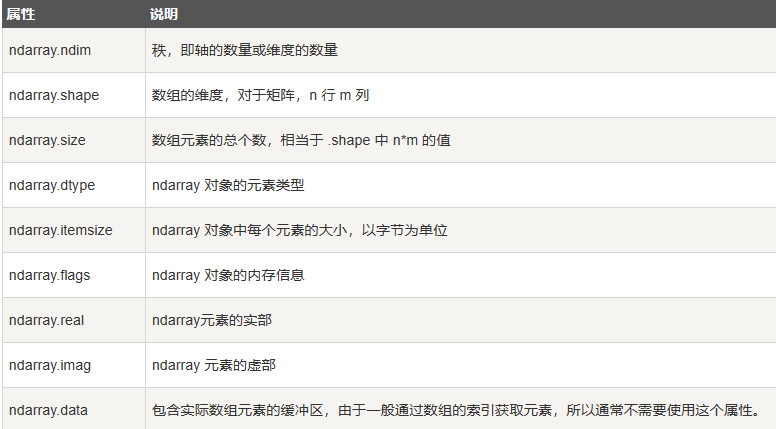
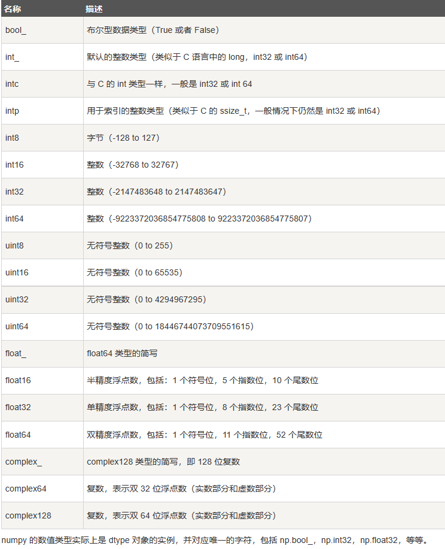
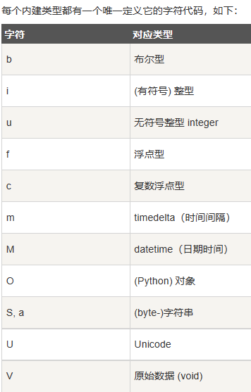

# NumPy入门

## 1.开发环境安装与配置

## 2.NumPy数组引出

## 3.NumPy数组创建


### **1.array()函数**

```python
numpy.array(object, dtype = None, copy = True, order = None, subok = False, ndmin = 0)
```



实例：

```python
import numpy as np

# 一维数组
# str>float>int
arr = np.array([1, 2, 3, 4, 5])
print(arr)
print(type(arr))

# 多维数据
arr2 = np.array([[1, 2, 3], [4, 5, 6]])
print(arr2)

# ndmin参数
arr3 = np.array([1, 2, 3, 4, 5], ndmin=2)
print(arr3)

# dtype参数
arr4 = np.array([1, 2, 3, 4, 5], dtype='f')
print(arr4)

# 结构化数据类型
student = np.dtype([("name", "S20"), ("age", "i4"), ("marks", "f4")])
arr5 = np.array([("jack", 18, 99.9), ('tom', 19, 98.9)], dtype=student)
print(arr5)


输出结果：
[1 2 3 4 5]
<class 'numpy.ndarray'>
[[1 2 3]
 [4 5 6]]
[[1 2 3 4 5]]
[1. 2. 3. 4. 5.]
[(b'jack', 18, 99.9) (b'tom', 19, 98.9)]
```


### **2.empty(函数)**

````python
numpy.empty(shape, dtype = float, order = 'C')
````


### **3.zeros()函数**

```python
numpy.zeros(shape, dtype = float, order = 'C')
```


### **4.ones()函数**

```python
numpy.zeros(shape, dtype = None, order = 'C')
```





实例：

```python
# empty()函数
arr6 = np.empty([3, 2], dtype=int)
print(arr6)

# zeros()函数
arr7 = np.zeros(5)
print(arr7)

# zeros()函数
arr8 = np.zeros([3, 2], dtype=[('x', 'i4'), ('y', '<f4')])
print(arr8)

# ones()函数
arr = np.ones(5)
print(arr)

arr = np.ones([2, 2], dtype=int)
print(arr)

输出结果：
[[ 6917529027641081856  5764616291768666155]
 [ 6917529027641081859 -5764598754299804209]
 [          4497473538      844429428932120]]
[0. 0. 0. 0. 0.]
[[(0, 0.) (0, 0.)]
 [(0, 0.) (0, 0.)]
 [(0, 0.) (0, 0.)]]
[1. 1. 1. 1. 1.]
[[1 1]
 [1 1]]
```


### **5.full()函数**

```python
numpy.zeros(shape, fill_value, dtype = None, order = 'C')
```


实例：

```python
# full()函数
arr = np.full(5, fill_value=1024)
print(arr)

arr = np.full([3, 2], fill_value=1024)
print(arr)

输出结果：
[1024 1024 1024 1024 1024]
[[1024 1024]
 [1024 1024]
 [1024 1024]]
```


### **6.eye()函数**

```python
numpy.eye(N, M=None, k=0, dtype = float, order = 'C')
N:行数量
M:列数量，默认等于行数量，可选
```


实例：

````python
# eye()函数
arr = np.eye(10, dtype=int)
print(arr)

输出结果：
[[1 0 0 0 0 0 0 0 0 0]
 [0 1 0 0 0 0 0 0 0 0]
 [0 0 1 0 0 0 0 0 0 0]
 [0 0 0 1 0 0 0 0 0 0]
 [0 0 0 0 1 0 0 0 0 0]
 [0 0 0 0 0 1 0 0 0 0]
 [0 0 0 0 0 0 1 0 0 0]
 [0 0 0 0 0 0 0 1 0 0]
 [0 0 0 0 0 0 0 0 1 0]
 [0 0 0 0 0 0 0 0 0 1]]
````


### 7.arange()函数

```python
numpy.arange(start, stop, step, dtype)
```




实例：

````python
# arange()函数
arr = np.arange(1, 11, 2)
print(arr)

输出结果：
[1 3 5 7 9]
````


### 8.linspace()函数(等差数列)

````python
np.linspace(start, stop, num=50, endpoint=True, retstep=False, dtype=None)
````




实例：

```python
# linspace()函数
arr = np.linspace(10, 20, 5, endpoint=True)
print(arr)

输出结果：
[10.  12.5 15.  17.5 20. ]
```


### 9.logspace()函数(等比数列)

### 

````python
np.logspace(start, stop, num=50, endpoint=True, base=10.0, dtype=None)
````




实例：

```python
# logspace()函数
arr = np.logspace(0, 9, 10, base=2)
print(arr)

输出结果：
[  1.   2.   4.   8.  16.  32.  64. 128. 256. 512.]
```


### 10.random



```python
#random.rand:生成[0，1)的随机数
#random.random:生成[0，1)的随机数,只有一个参数
#random.randint:生成随机数
#random.randn:返回一个或一组样本，具有标准正态分布
#random.normal:生成高斯分布的概率密度随机数
arr = np.random.rand(3, 2, 2)
print(arr)
arr = np.random.random(3)
print(arr)
arr = np.random.randint(0, 10, 5)
print(arr)
arr = np.random.randn(5)
print(arr)
arr = np.random.normal(loc=1, scale=2, size=5)
print(arr)

输出结果：
[[[0.83455931 0.47007578]
  [0.51213598 0.02273838]]

 [[0.19346981 0.89622419]
  [0.2443421  0.20138188]]

 [[0.76042282 0.69272803]
  [0.30832705 0.46549092]]]
[0.9525082  0.08431104 0.47679744]
[9 3 0 2 6]
[ 1.2942735  -1.29699803 -0.6108978  -0.40025928  0.13739733]
[ 1.64883912 -1.96748031  1.28676523  0.1288732   0.97815941]
```


## 4.NumPy数组属性




## 5.NumPy数据保存和数据类型

​     **数据类型：**







**数据类型对象 (dtype)**

数据类型对象（numpy.dtype 类的实例）用来描述与数组对应的内存区域是如何使用，它描述了数据的以下几个方面：

- 数据的类型（整数，浮点数或者 Python 对象）
- 数据的大小（例如， 整数使用多少个字节存储）
- 数据的字节顺序（小端法或大端法）
- 在结构化类型的情况下，字段的名称、每个字段的数据类型和每个字段所取的内存块的部分
- 如果数据类型是子数组，那么它的形状和数据类型是什么。


​	

```python
import numpy as np

# int8, int16, int32, int64 四种数据类型可以使用字符串 'i1', 'i2','i4','i8' 代替
dt = np.dtype('i4')
print(dt)
print(type(dt))

输出结果:
int32
<class 'numpy.dtype[int32]'>
```


## 6.NumPy数组运算

## 7.NumPy索引与切片 	

ndarray对象的内容可以通过索引或切片来访问和修改，与 Python 中 list 的切片操作一样。

ndarray 数组可以基于 0 - n 的下标进行索引，切片对象可以通过内置的 slice 函数，并设置 start, stop 及 step 参数进行，从原数组中切割出一个新数组。


实例：

```python
import numpy as np

arr = np.arange(10)
print(arr)

# 从索引 2 开始到索引 7 停止，间隔为1
s = slice(2, 7, 1)
print(arr[s])
# 冒号 : 的解释：如果只放置一个参数，如 [2]，将返回与该索引相对应的单个元素。
# 如果为 [2:]，表示从该索引开始以后的所有项都将被提取。
# 如果使用了两个参数，如 [2:7]，那么则提取两个索引(不包括停止索引)之间的项。
s1 = arr[2:7:2]
print(s1)


# 多维数组
a = np.array([[1, 2, 3], [3, 4, 5], [4, 5, 6]])
print(a)
# 从某个索引处开始切割
print('从数组索引 a[1:] 处开始切割')
print(a[1:])

a = np.array([[1, 2, 3], [3, 4, 5], [4, 5, 6]])
print(a[..., 1])   # 第2列元素
print(a[1, ...])   # 第2行元素
print(a[..., 1:])  # 第2列及剩下的所有元素


输出结果:
[0 1 2 3 4 5 6 7 8 9]
[2 3 4 5 6]
[2 4 6]
[[1 2 3]
 [3 4 5]
 [4 5 6]]
从数组索引 a[1:] 处开始切割
[[3 4 5]
 [4 5 6]]
[2 4 5]
[3 4 5]
[[2 3]
 [4 5]
 [5 6]]
```


### **高级索引**

NumPy 比一般的 Python 序列提供更多的索引方式。

除了之前看到的用整数和切片的索引外，数组可以由整数数组索引、布尔索引及花式索引。

**整数数组索引**

```python
import numpy as np 
 
x = np.array([[1,  2],  [3,  4],  [5,  6]]) 
y = x[[0,1,2],  [0,1,0]]  
print (y)


x = np.array([[  0,  1,  2],[  3,  4,  5],[  6,  7,  8],[  9,  10,  11]])  
print ('我们的数组是：' )
print (x)
print ('\n')
rows = np.array([[0,0],[3,3]]) 
cols = np.array([[0,2],[0,2]]) 
y = x[rows,cols]  
print  ('这个数组的四个角元素是：')
print (y)


a = np.array([[1,2,3], [4,5,6],[7,8,9]])
b = a[1:3, 1:3]
c = a[1:3,[1,2]]
d = a[...,1:]
print(b)
print(c)
print(d)

输出结果：
[1 4 5]
我们的数组是：
[[ 0  1  2]
 [ 3  4  5]
 [ 6  7  8]
 [ 9 10 11]]


这个数组的四个角元素是：
[[ 0  2]
 [ 9 11]]
[[5 6]
 [8 9]]
[[5 6]
 [8 9]]
[[2 3]
 [5 6]
 [8 9]]
```


**布尔索引**

```python
x = np.array([[  0,  1,  2],[  3,  4,  5],[  6,  7,  8],[  9,  10,  11]])  
print ('我们的数组是：')
print (x)
print ('\n')
# 现在我们会打印出大于 5 的元素  
print  ('大于 5 的元素是：')
print (x[x >  5])
print('大于5且小于10的元素：')
print('条件加小括号：')
print(x[(x > 5) & (x < 10)])
print('使用np.logical_and方法：')
print(x[np.logical_and(x > 5, x < 10)])
print('使用np.all方法：')
print(x[np.all([x > 5, x < 10],axis=0)])

a = np.array([np.nan,  1,2,np.nan,3,4,5])  
print (a[~np.isnan(a)])

输出结果：
大于 5 的元素是：
[ 6  7  8  9 10 11]
大于5且小于10的元素：
条件加小括号：
[6 7 8 9]
使用np.logical_and方法：
[6 7 8 9]
使用np.all方法：
[6 7 8 9]
[1. 2. 3. 4. 5.]
```